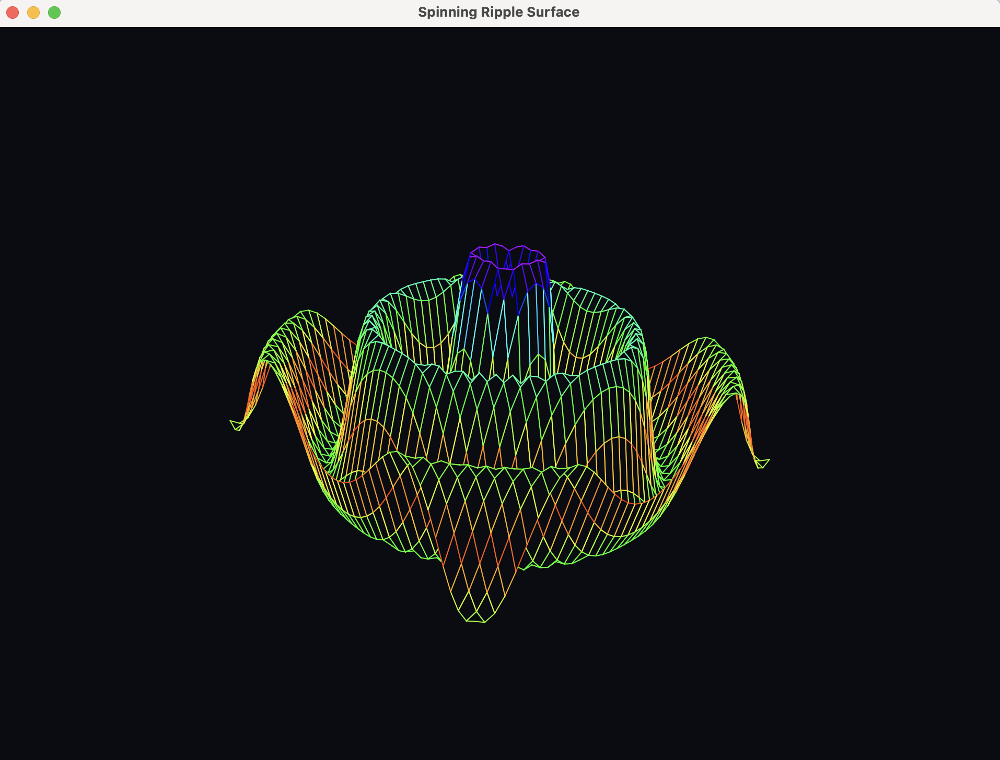

# Sombrero JavaFX

Animated spinning ripple surface rendered with JavaFX.

The application samples a cosine-based height field that decays with distance, spins the mesh about the Z axis, then applies a presentation tilt for projection. Quads are depth-sorted for hidden-line removal, and edges are colorized via HSV using height-based amplitude to map low-to-high elevations across the spectrum.



## How to run in local

```bash
./mvnw clean compile exec:java
```

### Performance Optimization

The application includes optimized JVM flags in `.mvn/jvm.config` that are automatically applied to all Maven commands. The configuration includes:

- **ZGC garbage collector** for low-latency real-time rendering
- **2GB heap** (adjustable based on your system)
- **512MB direct memory** for off-heap MemorySegment usage
- **Server-class JIT optimizations**

To customize JVM options, edit `.mvn/jvm.config` or override with `MAVEN_OPTS`:

```bash
# Override JVM options for a single run
MAVEN_OPTS="-XX:+UseG1GC -Xms4g -Xmx4g" ./mvnw clean compile exec:java
```

See `jvm-options.txt` for a complete list of performance tuning options and alternatives.

## References

- https://github.com/davepl/sombrero
- https://openjfx.io/
